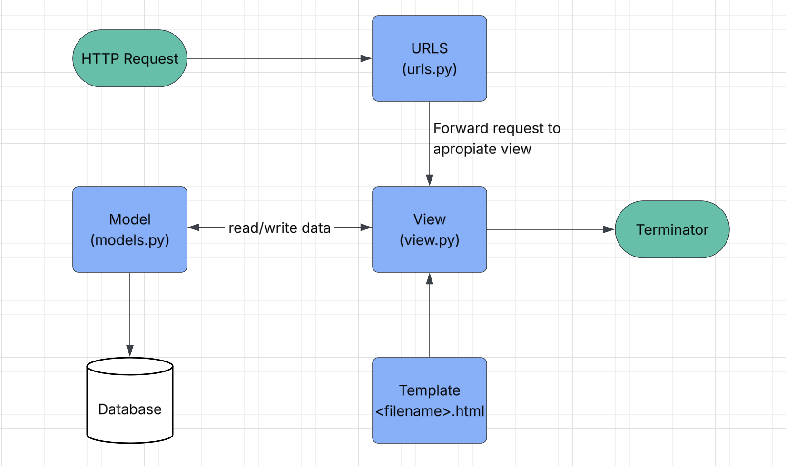
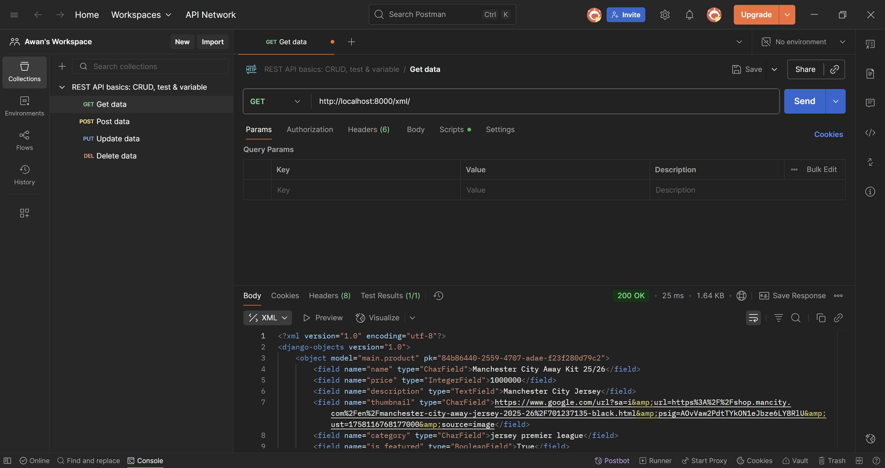
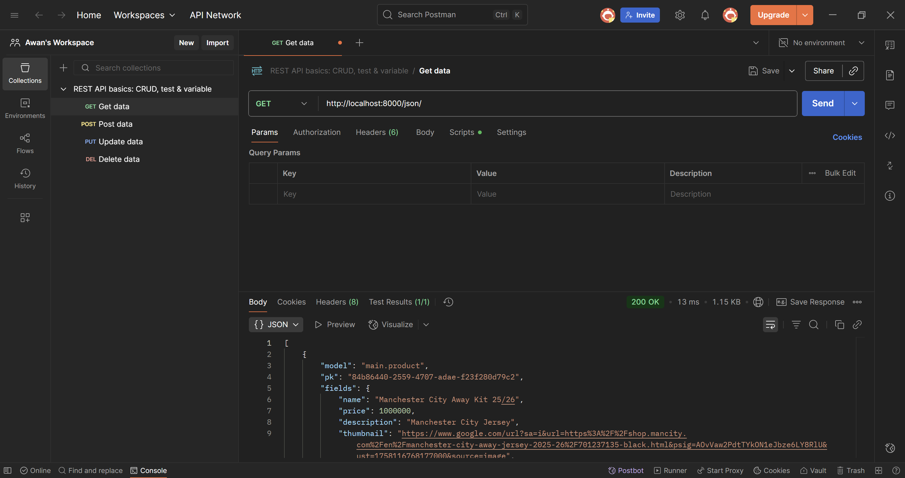
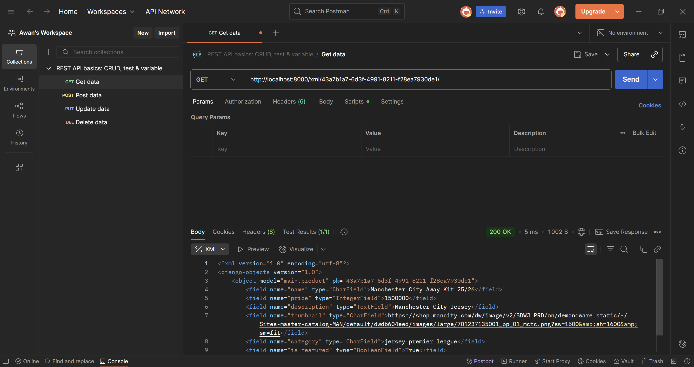
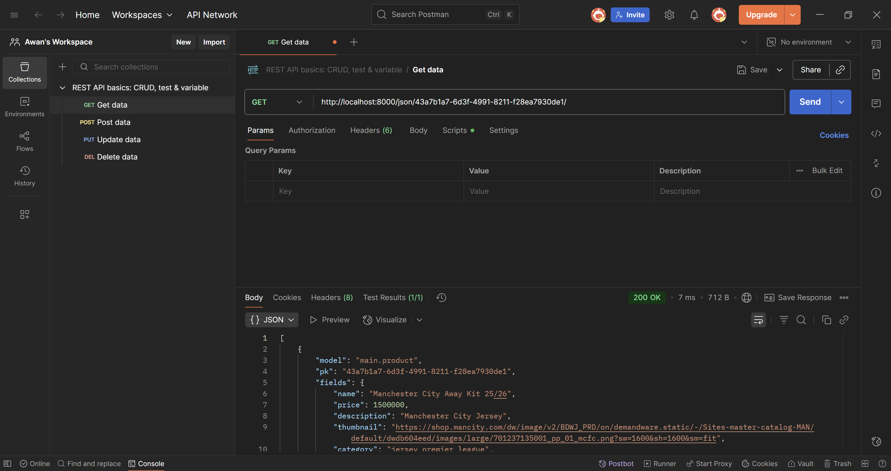

Tautan Aplikasi PWS: https://kadek-ngurah-saitamapensiunjerseystore.pbp.cs.ui.ac.id/

Tugas Individu 2

Jawaban dari pertanyaan-pertanyaan di Tugas Individu 2:

Soal Nomor 1

1. Menginiasi dan menghubungkan repositori GitHub dan direktori lokal untuk Saitama Pensiun Jersey Store
- Melakukan inisiasi repositori baru di GitHub dengan nama "Saitama-Pensiun-Jersey-Store"
- Membuat direktori lokal untuk proyek football shop dengan nama "Saitama Pensiun Jersey Store"
- Membuat branch utama baru dengan nama master
- Menghubungkan direktori lokal "Saitama Pensiun Jersey Store" dengan repository "Saitama-Pensiun-Jersey-Store"

2. Melakukan set up virtual environment, menyiapkan dependancies, dan membuat proyek Django
- Membuat virtual environment di direktori Saitama Pensiun Jersey Store
- Mengaktivan virtual environment
- Membuat berkas requirements.txt, lalu menambahkan beberapa dependancies
- Meng-install dependancies pada requirements.txt
- Membuat proyek Django dengan nama "SaitamaPensiunJerseyStore"

3. Mengkonfigurasi environment variables dan proyek Django-nya
- Membuat file .env lalu ditambahkan "PRODUCTION=False" 
- Membuat file .env.prod lalu diisi dengan kredensial database milik saya yang sudah dikirim ke email UI saya dan ditambahkan "PRODUCTION=True".
- Memodifikasi beberapa hal di settings.py
- Menambahkan berkas .gitignore

4. Membuat dan melakukan set up untuk aplikasi main
- Membuat aplikasi baru dengan nama main
- Mendaftarkan aplikasi main ke proyek "Saitama Pensiun Football Store"
- Membuat direktori "templates" di dalam direktori main
- Membuat berkas main.html yang berisi nama, NPM, dan kelas PBP saya sendiri
- Membuat kelas Product di models.py
- Mengisi kelas Product dengan atribut wajib yang sudah disebutkan di dokumen Tugas Individu 2
- Membuat dan melakukan migrasi model sekaligus melakukan migrasi database
- Menghubungkan view dengan template dengan memodifikasi beberapa hal di views.py dan main.html
- Mengonfigurasi routing URL aplikasi main dan routing URL proyek

5. Melakukan deployment melalui PWS
- Membuat proyek baru di PWS dengan nama "saitamapensiunjerseystore"
- Mengubah isi raw environment editor di PWS supaya sesuai dengan yang ada di file .env.prod
- Menambahkan URL deployment PWS pada settings.py 
- Melakukan git add, commit dan push ke repositori GitHub "Saitama-Pensiun-Jersey-Store"
- Melakukan git push pws master untuk menyimpan segala perubahan yang saya lakukan di proyek Saitama Pensiun Jersey Store
- Menjalankan perintah Project Command di PWS, lalu masuk menggunakan credentials yang ditampilkan sebelumnya
- Mengecek apakah website Saitama Pensiun Jersey Store sudah menampilkan apa yang ada di main.html dengan menekan tombol View Project
- SELESAI DEH

Soal Nomor 2    

Kaitan urls.py, views.py, models.py, dan berkas html
- urls.py berfungsi sebagai peta yang ngecocokin URL yg diminta oleh user dgn fungsi yg ada di views.py
- views.py akan menerima request dari urls.py, memprosesnya, lalu jika butuh membaca/menulis data maka akan manggil si models.py
- models.py tugasnya sebagai jembatan ke database, nyediain representasi data, ngelakuin query, lalu ngembaliin hasil ke view
- kalo datanya udah siap, views.py bakal nerusin ke berkas HTML yg punya tugas utk ngerender tampilan halaman web supaya bisa dilihat oleh user

Referensi:
- PPT "Introduction to the Internet and Web Framework" by Tim Dosen PBP (Page 28)
- https://www.w3schools.com/django/django_intro.php

Soal Nomor 3
- Menyimpan semua settings yang mengontrol jalannya aplikasi Django
- Menentukan working environment, apakah aplikasi bekerja dalam development mode atau production mode
- Memberi tahu Django database mana yang akan dipakai
- Menentukan aplikasi apa saja yang bakalan digunakan
- Menentukan proses middleware yang dilalui setiap ada request/response
- Mengatur resource proyek, seperti template, static file, dan media file
- Mengatur bahasa dan time zone
- Mengatur keamanan proyek

Referensi:
https://docs.djangoproject.com/en/stable/topics/settings/

Soal Nomor 4

- Migrasi di Django merupakan mekanisme utk menyinkronkan model Python di models.py dgn struktur tabel yang ada di database. Django memakai migrasi agar perubahan pada model (misalkan menambahkan field, menghapus tabel, dll) bisa terlihat di database tanpa harus menulis SQL scr manual. Gampangnya gini, misal saya melakukan perubahan di models.py. Untuk membuat file migrasi, saya akan menggunakan perintah "python manage.py makemigrations". Django akan membaca perubahan di models.py, terus dia akan membuat file migrasi di folder /migration. Utk meng-apply migrasi nya, saya hanya perlu menjalankan perintah "python manage.py migrate". Django bakalan nerjemahin instruksi dr file migrasi menjadi perintah SQL sesuai database yg dipake. Django juga selalu nyimpen catetan migrasi yg udh dijalanin di tabel khusus pada database. Jadi, si Django-Django ini bakalan tau migrasi mana yg udh atau blm diterapin. Kesimpulannya, migrasi di Django itu kayak jembatan antara kode Python dan database.

Referensi:
https://docs.djangoproject.com/en/stable/topics/migrations/

Soal Nomor 5
1. Fitur bawaan nya cukup lengkap
- Django bisa dibilang nyediain hampir semua kebutuhan dasar aplikasi web secara langsung, kayak sistem autentikasi, ORM, admin panel, manajemen URL, keamanan, migrasi database, dan masih banyak lagi. Hal inilah yg ngebuat pemula ga perlu repot-repot make library eksternal sehingga si pemula bisa lebih fokus ke konsep fundamental software development nya.
2. Dokumentasi yg bagus, rapi, dan gampang dimengerti
- Dokumentasi di Django ini bener-bener rapi, jelas, sistematis, pokoknya gampang dingertiin dah. Ada banyak tutorial juga yg bikin kita bisa paham step-by-step nya gimana.
3. Struktur proyek yg rapi dan terstandarisasi
- Django ngedorong kita dari awal utk ngikutin pola tertentu, di kasus Django ini yg dipake adalah MTV (Model-Template-Views). Jadi, kita bisa terbiasa dgn praktek software development yg ter-organize sejak awal, bukan nulis kode asal-asalan.
4. Banyak dipake di industri
- Django ini ternyata banyak dipake oleh perusahaan-perusahaan besar, kayak Instagram, Pinterest, Mozilla, dan masih bnyk lagi. Ini ngebuat pemula belajar sesuatu yg relevan dgn dunia kerja saat ini, bukan cuma framework yg dipake buat belajar doang trus kalo udah masuk ke industri kerja ga kepake lagi.

Referensi:
- https://realpython.com/tutorials/django/
- https://www.djangoproject.com/~

Soal Nomor 6
- Gak ada kak, aman semua. Asdos nya udah pada gercep kemaren, setiap ditanya langsung jawab dgn jelas, ga kaya asdos matkul d***, eh sorry hehe. Keep up the good work pokoknya kakak-kakak asdos PBP!

Tugas Individu 3

Jawaban dari pertanyaan-pertanyaan di Tugas Individu 3:

1. Alasan memerlukan data delivery dalam pengimplementasian sebuah platform
- karena data delivery memungkinkan data yg dikumpulkan di bagian satu (contohnya backend, database, API) dikirim ke bagian yang lain (contohnya frontend, aplikasi mobile) sehingga data menjadi sinkron dan tidak terjadi inkonsistensi.
- karena data delivery memastikan data terkirim dalam format yg dpt dimengerti oleh semua penerima (seperti JSON, XML, CSV, dsb.) sehingga data bisa lgsg dibaca dan diproses oleh user tanpa perlu konversi scr manual.
- karena data delivery memastikan informasi sampai dgn cepat agar keputusan dan layanan bisa real-time
- karena data delivery dapat menangani volume data besar dan bisa mengirim data dgn lancar
- karena data delivery menggunakan enkripsi, autentikasi, dan kontrol akses sehingga data terjamin aman 
- karena data delivery memiliki mekanisme pengiriman otomatis sehingga pekerjaan manual bisa dikurangi.

referensi: 
- https://www.datamanagementblog.com/data-delivery-four-challenges-one-solution/
- https://www.infoworld.com/article/2266722/why-you-need-a-data-integration-platform.html

2. Mana yang lebih baik antara XML dan JSON? Mengapa JSON lebih populer dibandingkan XML?

menurut saya, JSON lebih baik dari XML, alasannya sama seperti alasan mengapa JSON lebih populer dari XML, yaitu:
- data di JSON lebih singkat sehingga data JSON lebih ringan dari data XML
- JSON lebih mudah dibaca karena strukturnya mirip objek di bahasa pemrograman
- hampir semua RESTful API menggunakan JSON sebagai format default
- hampir semua bahasa pemrograman punya library bawaan utk JSON

referensi:
- https://www.w3schools.com/js/js_json_xml.asp
- https://www.geeksforgeeks.org/difference-between-json-and-xml/

3. Fungsi dari method is_valid() pada form Django dan alasan kita membutuhkannya

method is_valid() pada form Django berfungsi untuk:
- memeriksa apakah semua field sudah diisi sesuai aturan (misal "required=True", format email valid, panjang string sesuai, dsb)
- mengembalikan 'True' jika data valid dan 'False' jika datanya error
- menjalankan custom validation

alasan membutuhkan method is_valid():
- menjamin data sesuai aturan (misal menghindari data yg kosong, salah format, tidak sesuai tipe data-nya, dll.)
- mencegah input berbahaya masuk ke database
- memudahkan developer karena django sudah otomatis mengurus validasi dasar sehingga tidak perlu utk membuat logika validasi manual pada setiap field nya
- membuat error handling menjadi lebih terstruktur (misal jika ada form yg tidak valid, kita bisa lgsg menampilkan pesan error ke user)

referensi:
- https://docs.djangoproject.com/en/stable/ref/forms/api/#django.forms.Form.is_valid
- https://developer.mozilla.org/en-US/docs/Learn/Server-side/Django/Forms

4. Mengapa kita membutuhkan csrf_token saat membuat form di Django? Apa yang dapat terjadi jika kita tidak menambahkan csrf_token pada form Django? Bagaimana hal tersebut dapat dimanfaatkan oleh penyerang?

alasan membutuhkan crsf_token saat membuat form di django:
- untuk mencegah CSRF (Cross-Site Request Forgery) attack, yaitu serangan dmn penyerang mencoba mengelabui user agar mereka mengirim request berbahaya ke server tanpa sepengetahuan mereka.
- token ini juga memastikan bahwa form benar2 dikirim dari situs Django yg sah, bukan dari situs luar yg tidak dikenal

hal yg akan terjadi jika tidak menambahkan csrf_token:
- django akan menolak request form POST karena default nya django punya proteksi CSRF
- form menjadi rentan terhadap serangan CSRF

bagaimana hal tersebut dimanfaatkan oleh penyerang?
- Penyerang akan membuat page yg berisi form/post request tersembunyi. Jika korban dalam keadaan login ke aplikasi django, browser korban akan otomatis mengirimkan cookie session saat mengunjunginya page penyerang. Nah, karena tidak ada csrf_token, server gak akan bisa bedain apakah request berasal dari aplikasi sah atau dari situs gak jelas. Akibatnya, aksi berbahaya bisa dijalankan atas nama korban itu (misal ganti password, transfer uang, posting sesuatu, dan masih bnyk lagi)

5. Step by step mengimplementasikaan checklist
1) membuat skeleten sebagai kerangka views
- membuat folder templates baru di root project, lalu membuat berkas html baru bernama base.html yg berisi template tags Djangp
- menambahkan base.html ke variabel templates di settings.py
- mengubah main.html di folder main/templates supaya menggunakan base.html sbg template utama
2) membuat form input product
- membuat file baru bernama forms.py di folder main
- menambahkan fungsi create_product dan show_product di views.py
- menambahkan parh URL create_product dan show_product di urls.py
- memperbarui kode di main.html utk menampilkan data product dan button add product
- membuat dua file baru di folder main/templates, yaitu create_product.html utk halaman form input nya, dan product_detail.html utk detail product nya
- menambahkan url proyek ke settings.py
3) membuat pengembalian data dlm bentuk XML, JSON, XML by ID, dan JSON by ID dan mengakses keempat URL menggunakan postman
- membuat fungsi show_xml, show_json, show_xml_by_id, dan show_json_by_id di views.py
- membuat request baru utk url xml, json, xml by product id, dan json by product id lalu melakukan screenshot utk masing-masing request
- SELESAI

6. Gak ada kak, kemaren aman semua

Mengakses keempat URL dengan menggunakan Postman

Tugas Individu 4

Jawaban dari pertanyaan-pertanyaan di Tugas Individu 4:

1. AuthenticationForm adalah form bawaan Django yg biasanya dipakai utk memproses login user. Secara default, AuthenticationForm menyediakan dua field, yaitu username & password. Saat form divalidasi, Django akan memeriksa apakah username & password cocok dgn data user yg tersimpan di database. Kalo cocok, form bakal menghasilkan objek user yg bisa diakses melalui form.get_user().
## Kelebihan
- Ga perlu membuat form login dari nol sehingga bisa menghemat waktu
- Otomatis memakai backend autentikasi Django, mendukung hashing password, login, dan session management.
- Memvalidasi akun secara otomatis
- Gampang dipakai dgn LoginView (tinggal nambahin di URL routing)
- Bisa dikustomisasi, seperti ditambahin widget, label, atau CSS
## Kekurangan
- Terbatas hanya utk login dasar (Ga mencakup fitur seperti remember me, two-factor authentication, atau captcha.)
- Tampilan default sederhana (perlu dikustomisasi sendiri)
- Kalo mau login dengan email/identifier lain, harus override field username/buat form kustom
- Kurang fleksibel utk kebutuhan kompleks, misal ika butuh login dengan OAuth, social media, atau multi-step login, maka butuh utk dimodifikasi manual

Referensi:
https://docs.djangoproject.com/en/stable/topics/auth/default/#django.contrib.auth.forms.AuthenticationForm
https://github.com/django/django/blob/main/django/contrib/auth/forms.py

2. Autentikasi adalah proses memverifikasi identitas user, sedangkan otorisasi adalah proses menentukan hak akses user setelah identitas verifikasi. Contoh dari autentikasi adalah login dgn username & password, sedangkan contoh dari otorisasi adalah cuma admin yg boleh menghapus data.
## Implementasi Autentikasi di Django
Django punya sistem autentikasi bawaan di django.contrib.auth yang mencakup:
- User model yg berfungsi menyimpan username, password, email, dsb
- AuthenticationForm & LoginView yg berfungsi utk memproses login
- AUTHENTICATION_BACKENDS yg berfungsi utk mengatur cara Django memverifikasi kredensial
- Session framework yg berfungsi utk menyimpan status login user
## Implementasi Otorisasi di Django
Django juga menyediakan sistem otorisasi berbasis permissions & groups.
- Permissions artinya setiap model dpt memiliki permission bawaan seperti add, change, delete, view. Kalo mau membuat permission kustom juga bisa
- Groups merupakan sekumpulan permission yg bisa diberikan ke banyak user sekaligus
Selain permission & groups, Django juga menyediakan decorator & mixins utk membatasi akses.
- @login_required dipakai supaya hanya user yang login bisa mengakses view.
- @permission_required('app_name.permission_code') dipakai supaya hanya user dengan permission tertentu bisa akses.
- User.is_staff dan User.is_superuser merupakan level otorisasi khusus untuk admin.

Referensi:
https://docs.djangoproject.com/en/stable/topics/auth/default/
https://docs.djangoproject.com/en/stable/topics/auth/default/#authorization
https://docs.djangoproject.com/en/stable/topics/auth/

3. Kelebihan dan kekurangan session dan cookies dalam konteks menyimpan state di aplikasi web
## Kelebihan Cookies
- Tidak membebani server karena data ada di browser
- Bisa bertahan meskipun browser ditutup
- Mudah dipakai karena lgsg tersedia di setiap request HTTP
- Bisa diakses lintas halaman/domain
## Kekurangan Cookies
- Ukuran terbatas (biasanya hanya 4KB per cookie)
- Kurang aman karena bisa dilihat dan dimodifikasi oleh user
- Tidak cocok untuk data sensitif, seperti password, data pribadi, token
- Dikirim di setiap request sehingga menambah overhead jaringan
## Kelebihan Sessions
- Lebih aman karena data tidak disimpan di client
- Bisa menyimpan data kompleks (dgn menggunakan dictionary, objek user, dsb)
- Size fleksibel karena tidak dibatasi 4KB saja seperti cookie
## Kekurangan Sessions
- Membebani server karena semua data harus disimpan di sisi server (memory, database, cache)
- Butuh manajemen tambahan, misalnya session timeout, cleanup, scaling untuk aplikasi besar
- Kalau session berakhir, user harus login ulang
- Butuh cookie atau mekanisme lain untuk menyimpan session ID

Referensi:
https://developer.mozilla.org/en-US/docs/Web/HTTP/Cookies
https://cheatsheetseries.owasp.org/cheatsheets/Session_Management_Cheat_Sheet.html

4. Tidak aman-aman bgt karena user bisa melihat & mengubah cookies melalui developer tools browser. Beberapa risiko potensial yg harus diwaspadai.
- Risiko penyadapan, yaitu jika dikirim melalui koneksi HTTP biasa, cookies bisa dicuri
- Cross-Site Scripting (XSS), yaitu jika cookie tidak dilindungi, script berbahaya bisa mencuri cookie melalui document.cookie
- Cross-Site Request Forgery (CSRF), yaitu cookie dikirim otomatis oleh browser ke server sehingga bisa dimanfaatkan oleh attacker utk mengirim request palsu.
## Cara Django Menangani Hal Tersebut
Django punya banyak mekanisme bawaan untuk meminimalkan risiko, bbrp di antaranya adalah
- HttpOnly flag yg berfungsi utk mencegah akses cookie via JavaScript
- Secure flag yg berfungsi utk memastikan cookie hanya dikirim lewat HTTPS, bukan HTTP
- SameSite attribute yg berfungsi utk melindungi dari CSRF dgn membatasi pengiriman cookie lintas domain
- Django secara default menambahkan CSRF token utk form POST sehingga request palsu tidak bisa hanya mengandalkan cookie
- Django bisa menggunakan signed cookies via django.core.signin sehingga isi cookie tidak bisa dimodifikasi tanpa terdeteksi

Referensi:
https://docs.djangoproject.com/en/stable/topics/http/sessions/#using-cookies-directly
https://developer.mozilla.org/en-US/docs/Web/HTTP/Cookies

5. Cara mengimplementasikan checklist
- menambahkan fungsi register ke dalam views.py
- membuat file html baru, yaitu register.html di subfolder templates dalam folder main
- menambahkan URL routing utk fungsi view register
- menambahkan fungsi login_user ke dalam views.py
- membuat file html baru, yaitu login.html di subfolder templates dalam folder main
- menambahkan URL routing utk fungsi view login_user
- menambahkan fungsi logout_user ke dalam views.py
- menambahkan logout button di main.html
- menambahkan URL routing utk fungsi view login_user
- menambahkan potongan kode "@login_required(login_url='/login')" di atas fungsi view show_main dan show_product
- mengubah kode pada blok "if form.is_valid()" di fungsi view login_user
- menambahkan potongan kode "'last_login': request.COOKIES['last_login']" ke dlm variabel context di fungsi views show_main
- mengubah fungsi views logout_user di views.py
- menambahkan informasi sesi terakhir login di main.html
- menambahkan potongan kode "user = models.ForeignKey(User, on_delete=models.CASCADE, null=True)" pada model Product di models.py utk menghubungkan satu user dgn satu product melalui sebuah relationship
- mengubah kode di blok "if form.is_valid() and request.method == 'POST':" di fungsi view create_product di views.py
- memodikasi fungsi view show_main di views.py supaya user bisa memilih untuk menampilkan product miliknya sendiri saja (opsi 'my') atau menampilkan ssemua product yg tersedia (opsi 'all') dan informasi name dari user akan menampilkan username dari user yg sedang login
- menambahkan tombol filter 'My' dan 'All' di main.html
- menampilkan nama penjual product di main.html
- membuat dua akun user dan 3 dummy data pada masing-masing user di server lokal

Tugas Individu 5

1. Urutan prioritas (cascade) ketika beberapa selector menargetkan elemen yang sama
#### Browser bakalan milih deklarasi CSS berdasarkan urutan prioritas: 
- (1) !important (yang dari author vs user juga dipertimbangkan oleh origin).
- (2) Inline style (style="...") tanpa !important.
- (3) Selector dengan ID (#header).
- (4) Selector dengan kelas/attribute/pseudo-class (.nav, [type="text"], :hover).
- (5) Type selector / pseudo-element (div, ::before).
- (6) Jika spesifisitasnya sama maka aturan yg muncul belakangan (source order) menang.

referensi: https://developer.mozilla.org/en-US/docs/Web/CSS/CSS_cascade/Specificity?

2. Mengapa responsive design penting dan contoh aplikasi yg sudah/blm menerapkan RWD beserta alasannya
### alasan:
- User experience: memastikan konten dpt dibaca dan dinavigasi di layar kecil (mobile) sampai besar (desktop).
- Aksesibilitas & performa: tata letak yang responsif biasanya memperhatikan ukuran gambar, teks, dan interaksi sehingga lebih cepat dan mudah digunakan.
SEO & bisnis: mesin pencari memberi nilai pada situs mobile-friendly sehingga jangkauan pengguna lebih luas.
### aplikasi yang sudah menerapkan RWD
Airbnb adalah salah satu contoh perusahaan yg berfokus pada mobile & web. Halaman-halamannya dirancang agar berfungsi baik di berbagai ukuran layar. Alasan mereka menerapkan RWD adalah pengalaman pemesanan harus smooth di HP maupun desktop saat pengguna mencari dan memesan perjalanan.
### aplikasi yang blm menerapkan RWD
Craigslist merupakan salah satu aplikasi yang dikenal mempertahankan tampilan sangat sederhana dan tidak banyak melakukan redesign responsif, banyak analisis/desain case-study menunjukkan ia tetap bergantung pada UI klasik meski fungsional. Alasan mereka tidak menerapkan RWD adalah trade-off antara kesederhanaan, performa, dan model bisnis. Selain itu, beberapa layanan memilih tetap minimal karena target penggunanya.

referensi:
https://developer.mozilla.org/en-US/docs/Learn_web_development/Core/CSS_layout/Responsive_Design
https://responsivewebdesign.com/podcast/airbnb/
https://webdesignerdepot.com/will-craigslist-ever-get-a-redesign-the-internets-most-stubborn-dinosaur/

3. Perbedaan margin, border, dan padding serta cara implementasinya
### Perbedaan:
- Padding adalah ruang di dalam kotak. Tepatnya di antara content dan border. Menambah padding artinya menambah ruang dalam kotak.
- Border adalah garis/perimeter di sekitar padding. Bisa punya lebar, gaya, warna.
- Margin adalah ruang di luar border. Fungsinya utk memisahkan elemen dari elemen lain.

### Cara mengimplementasikannya
.box {
  width: 300px;             
  padding: 16px;              
  border: 2px solid #333;     
  margin: 24px;              
  box-sizing: border-box;     
}

referensi: https://developer.mozilla.org/en-US/docs/Web/CSS/box-sizing?

4. Konsep flexbox dan grid layout beserta kegunaannya
### flexbox
- Dirancang untuk satu dimensi. Biasanya dipakai utk mengatur item dalam satu baris atau satu kolom
- Kuat untuk distribusi ruang di sepanjang satu sumbu, alignment (center, space-between, dll), dan reorder item secara fleksibel.
- Kegunaan: utk navbar, card row, komponen UI yang perlu menyeimbangkan ukuran children nya.
### grid layout
- Dirancang untuk dua dimensi (baris dan kolom secara bersamaan).
- Memungkinkan explicit grid (menentukan grid-template-columns/rows) dan penempatan item ke dalam area/garis tertentu.
- Kegunaan: sangat cocok utk layout halaman besar (misal area header/main/sidebar/footer), dashboard, atau layout kompleks yang perlu kontrol baris/kolom dan area yang named.

referensi: https://developer.mozilla.org/en-US/docs/Web/CSS/CSS_grid_layout?

5. Cara mengimplementasikan checklist
- membuat view function baru bernama edit_product di views.py
- membuat file html baru bernama edit_product.html di folder main/templates
- melakukan routing untuk fungsi edit_product di urls.py
- mengupdate loop product_list di main.html utk memunculkan button edit
- membuat view function baru bernama delete_product di views.py
- melakukan routing untuk fungsi delete_product di urls.py
- mengupdate loop product_list di main.html utk memunculkan button delete
- membuat file templates baru bernama navbar.html
- menautkan navbar ke main.html
- mengonfigurasi static files di settings.py
- menambahkan global css
- menghubungkan global css dgn bootstap
- menambahkan custom styling ke global css
- menambahkan card_product.html di main/templates
- melakukan styling pada semua file di main/templates
- membuat tiga button utk card product, yaitu read, edit, dan delete
- menambahkan icon no-product.png di main.html jika tidak ada product untuk ditampilkan
- SELESAI

Tugas Individu 6

Jawaban:

1. Perbedaan synchronous request vs asynchronous request
- Synchronous request: pemanggilan yang blocking — browser/JS menunggu respons dari server sebelum melanjutkan eksekusi kode. Akibatnya UI bisa “membeku” kalau server lambat.
- Asynchronous request: pemanggilan non-blocking — JS mengirim request lalu bisa terus menjalankan kode lain; ketika respons datang, callback / Promise menangani hasilnya. Ini memungkinkan interaksi yang lebih lancar dan responsif.
- Referensi:
https://developer.mozilla.org/en-US/docs/Web/API/XMLHttpRequest_API/Synchronous_and_Asynchronous_Requests
https://nordicapis.com/the-differences-between-synchronous-and-asynchronous-apis/

2. Bagaimana AJAX bekerja di Django — alur request–response
- Klien (browser): pengguna melakukan aksi (klik/form submit). JS (Fetch API / XMLHttpRequest / jQuery.ajax) membentuk request (GET/POST/PUT/DELETE) dan mengirim ke URL endpoint di server.
- Header penting: untuk metode “unsafe” (POST/PUT/DELETE) sertakan token CSRF (X-CSRFToken) atau gunakan cookie CSRF agar Django bisa memverifikasi.
- Django menerima request: Django membuat HttpRequest lalu memetakan ke view sesuai URL routing. Middleware (termasuk CSRF middleware) memproses request.
- View: memproses data (validasi, autentikasi, DB), lalu mengembalikan response — untuk AJAX biasanya JsonResponse atau HttpResponse dengan application/json.
- Klien: JS menerima JSON/HTML fragment, lalu memanipulasi DOM (update bagian halaman) tanpa reload penuh.
- Referensi:
https://docs.djangoproject.com/en/5.2/ref/request-response/
https://testdriven.io/blog/django-ajax-xhr/

3. Keuntungan menggunakan AJAX dibandingkan render biasa
- Perceived performance lebih baik — hanya bagian halaman yang berubah sehingga terasa lebih cepat bagi pengguna.
- Hemat bandwidth / server load — mengirim data kecil (JSON / fragment) dibanding seluruh HTML halaman.
- Menjaga state klien — input form, posisi scroll, state JS tidak hilang karena tidak reload seluruh halaman.
- Interaktivitas real-time — cocok untuk update live, validasi inline, autocomplete, polling atau partial refresh.
- UX lebih halus — transisi dan feedback instan (mis. notifikasi tanpa reload).
- Referensi:
https://www.jsoftware.us/vol3/jsw0303-04.pdf
https://www.greatfrontend.com/questions/quiz/what-are-the-advantages-and-disadvantages-of-using-ajax

4. Cara memastikan keamanan saat menggunakan AJAX untuk fitur Login dan Register di Django
- Prinsip utama: jangan re-implement auth dengan cara yang tidak aman; pakai best practices Django + standar web security.
## Hal-hal yang perlu dilakukan untuk memastikan keamanan:
1) CSRF: pastikan middleware CSRF aktif dan kirim token CSRF di header (X-CSRFToken) saat melakukan POST/PUT/DELETE dari JS. Jangan menonaktifkan CSRF untuk form sensitif. 
2) HTTPS/TLS: selalu kirim kredensial lewat HTTPS agar token/credential tidak bocor. (transport security). 
3) Validasi & sanitasi server-side: jangan hanya mengandalkan JS; validasi username/password/email di server.
4) Hindari mengembalikan data sensitif: response JSON untuk login tidak boleh mengandung password, session secret, atau data sensitif lainnya. Kembalikan only what’s necessary (status, pesan, token non-sensitive).
5) Gunakan mekanisme otentikasi yang tepat:
- untuk web normal gunakan session cookies (Secure, HttpOnly, SameSite) + CSRF;
- untuk API (mobile/third-party) gunakan token (JWT atau token berbasis server) dengan kebijakan CORS yang ketat. 
6) Rate limiting & brute-force protection: pakai paket seperti django-axes, atau middleware throttling agar percobaan login berulang dibatasi.
7) Proteksi terhadap XSS: XSS bisa mencuri cookie/CSRF token; lakukan output escaping, Content Security Policy (CSP), dan validasi input.
- Referensi:
https://cheatsheetseries.owasp.org/cheatsheets/Cross-Site_Request_Forgery_Prevention_Cheat_Sheet.html
https://docs.djangoproject.com/en/5.2/howto/csrf/

5. Bagaimana AJAX mempengaruhi User Experience (UX) website
## Positif
- Responsif & terasa cepat — karena hanya sebagian halaman diperbarui, pengguna merasakan latency lebih kecil.
- Lebih interaktif — inline validation, live search, notifikasi, dan update real-time meningkatkan engagement.
 ## Negatif
- Back/forward button & URL — AJAX tanpa pengelolaan history membuat back button tidak konsisten; gunakan History API (pushState/popstate) bila perlu. 
- Aksesibilitas & progressive enhancement — pastikan fungsionalitas penting tetap bekerja tanpa JS atau sediakan fallback; desain dengan progressive enhancement agar pengguna dengan kemampuan terbatas tetap dapat mengakses konten. 
- Feedback & keandalan — karena aksi terjadi di background, berikan indikator loading, konfirmasi sukses/gagal, dan handling untuk kegagalan jaringan agar pengguna tidak bingung. (juga perhatikan konsistensi state sehingga pengguna yakin data tersimpan).